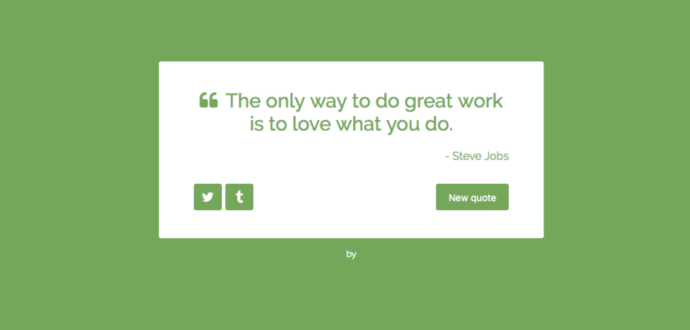

<h1 style="color:blue;text-align:center;">Project 1: Quotes Machine</h1>
<h2>Project Link: <a href='https://hopeful-poincare-30c654.netlify.com/'><i>here</i></a></h2>

final version example

This project is created using React.
<pre>  User can display a new quote randomly by refresfing or clicking the new quote button.
       User can tweet the current quote to twitter by clicking the twitter icon. 
</pre>
